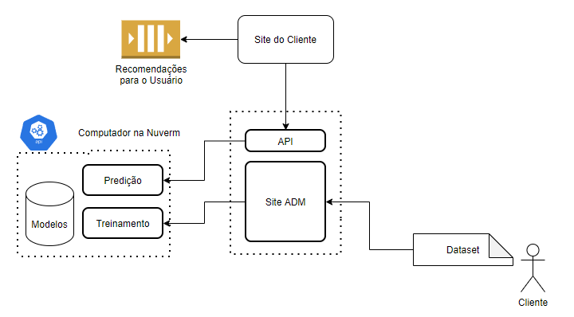
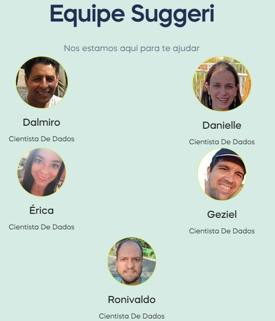

# Suggeri

Suggeri é um sistema de recomendação como serviço usando inteligência artificial.

Você recomenda produtos para seus clientes no seu site/e-commerce? Então a Suggeri é pra você!! Estamos trazendo uma ferramenta inteligente de recomendação de produto com base no que realmente os seus consumidores compram para que você possa vender muito mais!

Diga adeus às recomendações genéricas e segmentação teórica. No nosso sistema, você simplesmente carrega uma base de dados das vendas reais de sua própria empresa e automaticamente treinamos um modelo de Machine Learning especial para sua empresa.

Assista ao vídeo abaixo para saber mais e confira todos os detalhes no site http://www.suggeri.com.br/.

## Vídeo Explicativo

Clique na imagem acima ou acesse o link https://www.youtube.com/watch?v=ISAjxbkh82M

## Infra-estrutura:

Temos uma infra-estrutura completa na nuvem para garantir o melhor serviço a qualquer momento.

Como estamos estruturados:
- [Site do Suggeri](http://www.suggeri.com.br/), explicando o funcionamento e preços;
- [Documentação da API](http://www.suggeri.com.br/api.html), com todos os detalhes de como acessar o serviço;
- [Site Administrativo](https://suggeri.anvil.app/) para receber as empresas e suas bases de dados;
- API para receber as chamadas dos sites dos clientes;
- Servidor na nuvem escalável para treino automático de modelos a partir das bases.

## Experimente

Veja em tempo real o sistema de recomendação funcionando em nosso site na aba [Experimente](http://www.suggeri.com.br/#m-experimente).

## Tutorial

Baixe o [dataset de exemplo](./data/dataset_test.csv) e siga o passo a passo do nosso [Tutorial](http://www.suggeri.com.br/tutorial.html) para experimentar agora mesmo a melhor ferramenta de recomendação de produto do mercado.

## DSA Mentoria - Turma 2

A Suggeri é uma startup criada como parte do Projeto da Turma 2 da Mentoria do Programa DataScienceAcademy.

O [Sumário Executivo](./desenvolvimento/sumario_executivo.md) do projeto contém um resumo do projeto, as ferramentas utilizadas, lições aprendidadas e links importantes.

Mais detalhes do programa no [Regulamento](https://blog.dsacademy.com.br/programa-de-mentoria-entre-os-alunos-dsa-temporada-2021/).

## Behind the hood

Saiba todos os detalhes de como foi desenvolvido e como executar neste [link](./desenvolvimento).

## Equipe

Conheça um pouco mais da equipe que trabalha duro todos os dias para garantir a melhor experiência para a sua empresa.

Mentoria:
 - [Ronivaldo Sampaio](https://github.com/ronivaldo/)

Mentorados:
- [Dalmiro Esteves](https://github.com/dalmiroe)
- [Danielle Pequito](https://github.com/danipequito)
- [Érica Xavier](https://github.com/ericaxv)
- [Geziel Campos](https://github.com/gezielmc)
