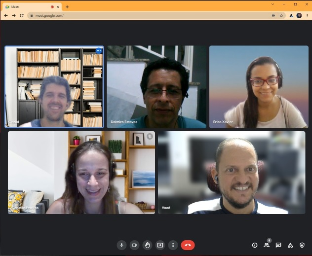

# Sessões

As sessões são organizadas pelo Mentor e acontecem semanalmente pelo Meet para o acompanhamento das atividades do projeto.

## Lista de sessões

Lista de sessões realizadas com os participantes.

Tabela de presença:

Membro   |S01|S02|S03|S04|S05|S06|S07|S08|S09|S10|S11|S12|S13|
--       |-- |-- |-- |-- |-- |-- |-- |-- |-- |-- |-- |-- |-- |
Danielle | X | X | X | X | X | X | X | X | X | X |   | X | X |
Dalmiro  | X | X | X | X | X | X | X | X | X |   | X | X | X |
Érica    | X | X |   | X | X | X |   | X | X | X | X | X | X |
Geziel   | X | X | X | X | X | X | X | X | X | X | X | X | X |
Ronivaldo| X | X | X | X | X | X | X | X | X | X | X | X | X |

## S13 - Preparação para a entrega final

Em 28/09/2021, cada participante mostrou o estudo sobre a sua tarefa e o mentor analisou junto aos membros as pendências de cada subsistema e deu orientações para a solução.

Mostras:
- Arquitetura da API e Server Anvil: Geziel
- Página do Server Anvil: Erika
- Site: Dalmiro

Definições:
- Geziel
  - Instalar Docker e Compose na instância do Google Cloud
  - Implantar o código de Cache
  - Adicionar try/except na API avisando de quando der erro
  - Gerar dataset com poucos dados
  - Atualizar Notebook base da API
- Ronivaldo
  - Domínio suggeri.com.br
  - Enviar para Geziel tutorial de instalação do Docker
  - Criar Cache para n modelos na memória
  - Migrar Código para Docker escalável com volume
  - Parametrizar URL e KEY do Anvil
  - Tirar dúvidas
  - Vídeo explicativo
  - Monitoramento da API por serviço externo
- Dalmiro
   - Atualizar URL no javascript
   - Tutorial: Como treinar e testar um modelo de Recomendação com a Suggeri
   - Migrar site para suggeri.com.br na Locaweb
- Danielle
   - Finalizar Notebook de como chegamos no Suggeri com textos e imagens

Atividade para a próxima sessão:
- Mentor: suporte de 20 min para dúvidas até a próxima sessão
- Mentorados: apresentar em 15 min o andamento das tarefas

Participantes:
- Dalmiro
- Érika
- Geziel
- Ronivaldo

## S12 - Resolução de Problemas Pendentes Críticos

Em 23/09/2021, cada participante mostrou o estudo sobre a sua tarefa e o mentor analisou junto aos membros as pendências de cada subsistema e deu orientações para a solução.

Mostras:
- Arquitetura da API e Server Anvil: Geziel
- Página do Server Anvil: Erika
- Site: Dalmiro

Definições:
- Geziel
  - Disponibilizar modelo fixo e treinado
  - Enviar 3 URLs completas com 3 usuários e produtos
  - Gerar dataset com poucos dados
  - Atualizar Notebook base da API
  - Adicionar try/except na API
- Erika
  - Alterar textos explicativos
  - Alterar select do modelo
- Ronivaldo
  - Código cliente da API para várias linguagens
  - Tirar dúvidas
  - Vídeo explicativo
- Dalmiro
   - Alterar textos
   - Desenvolver código do Carroussel mostrando as recomendações de teste
- Danielle
   - Montar Notebook de como chegamos no Suggeri

Atividade para a próxima sessão:
- Mentor: suporte de 20 min para dúvidas até a próxima sessão
- Mentorados: apresentar em 15 min o andamento das tarefas

Participantes:
- Dalmiro
- Érika
- Geziel
- Ronivaldo

## S11 - Resolução de Problemas Pendentes Críticos

Em 09/09/2021, cada participante mostrou o estudo sobre a sua tarefa e o mentor analisou junto aos membros as pendências de cada subsistema e deu orientações para a solução.

Mostras:
- Arquitetura da API e Server Anvil: Geziel
- Página do Server Anvil: Erika
- Carroussel mostrando as recomandações de teste: Dalmiro

Definições:
- Geziel
  - Integrar com o visual da parte da Erika
  - Disponibilizar Endereço correto e com dados para Dalmiro
  - Publicar na Nuvem
- Erika
  - Integrar com o código da API
- Ronivaldo
  - Código cliente da API para várias linguagens
  - Tirar dúvidas
- Dalmiro
   - Desenvolver código do Carroussel mostrando as recomandações de teste
   - Colocar 5 botões para recomendação

Atividade para a próxima sessão:
- Mentor: suporte de 20 min para dúvidas até a próxima sessão
- Mentorados: apresentar em 15 min o andamento das tarefas

Participantes:
- Dalmiro
- Érika
- Geziel
- Ronivaldo

## S10 - Resolução de Problemas Pendentes Críticos

Em 02/09/2021, cada participante mostrou o estudo sobre a sua tarefa e o mentor analisou junto aos membros as pendências de cada subsistema e deu orientações para a solução.

Mostras:
- Arquitetura da API e Server Anvil: Geziel
- Página do Server Anvil: Erika

Definições:
- Geziel
  - Integrar com o visual da parte da Erika
  - Disponibilizar o Código par Ronivaldo
  - Disponibilizar o ServerCode para Érika
  - Publicar na Nuvem
- Erika
  - Integrar com o código da API
- Ronivaldo
  - Salvar o requirements.txt e codigo Python
  - Tirar dúvidas
- Dalmiro
   - Desenvolver código do Carroussel mostrando as recomandações de teste
- Danielle
  - Ajudar o Dalmiro no site

Atividade para a próxima sessão:
- Mentor: suporte de 20 min para dúvidas até a próxima sessão
- Mentorados: apresentar em 15 min o andamento das tarefas

Participantes:
- Danielle
- Érika
- Geziel
- Ronivaldo

## S09 - Resolução de Problemas Pendentes Críticos

Em 26/08/2021, cada participante mostrou o estudo sobre a sua tarefa e o mentor analisou junto aos membros as pendências de cada subsistema e deu orientações para a solução.

Mostras:
- Arquitetura da API e Server Anvil: Geziel
- Página do Server Anvil: Erika

Definições:
- Geziel
  - Separar os códigos em módulos
  - Integrar o código do Colab para acionar a API para atualizar os estados dos modelos
  - Integrar com o visual da parte da Erika
- Erika
  - Criar uma linha nova na tabela via codigo e atualizar a partir de uma chave de pesquisa
  - Preecher um DropDown com modelo_id a partir de dados do banco de dados do usuário logado
  - Na Tabela de Modelos, adicionar um campo usuário que criou o modelo
  - Filtrar nas telas apenas os modelos criados pelo usuário logado
  - Criar um nome da aplicação para publicar: suggeri
- Ronivaldo
  - Criar funcao modelo usando requests para chamar a API
  - Tirar dúvidas
- Dalmiro
   - Desenvolver código do Carroussel mostrando as recomandações de teste
- Danielle
  - Ajudar o Dalmiro no site

Atividade para a próxima sessão:
- Mentor: suporte de 20 min para dúvidas até a próxima sessão
- Mentorados: apresentar em 15 min o andamento das tarefas

Participantes:
- Danielle
- Dalmiro
- Érika
- Geziel
- Ronivaldo

## S08 - Resolução das Pendências Críticas

Em 19/08/2021, cada participante mostrou o estudo sobre a sua tarefa e o mentor analisou junto aos membros as pendências de cada subsistema e deu orientações para a solução.

Mostras:
- Arquitetura da API e Server Anvil: Geziel
- Página do Server Anvil: Erika
- Site de Testes de Recomendações: Delmiro

Definições:
- Dalmiro
   - Desenvolver código do Carroussel mostrando as recomandações de teste
- Geziel
  - Unificar os esqueletos do Modelo e Backend para as chamadas do Frontend+API
  - Criar http_endpoint de testes com retornos fixos
- Erika
  - Corrigir link dos menus
- Ronivaldo
  - Tirar dúvidas

Atividade para a próxima sessão:
- Mentor: suporte de 20 min para dúvidas até a próxima sessão
- Mentorados: apresentar em 15 min o andamento das tarefas

Participantes:
- Danielle
- Dalmiro
- Érika
- Geziel
- Ronivaldo

## S07 - Endereçamento das Pendências

Em 13/08/2021, cada participante mostrou o estudo sobre a sua tarefa e o mentor analisou junto aos membros as pendências de cada subsistema e deu orientações para a solução.

Mostras:
- Arquitetura da API e Server Anvil: Geziel

Definições:
- Dalmiro
   - Finalizar Site com Recomendação
- Geziel
  - Unificar os esqueletos do Modelo e Backend para as chamadas do Frontend+API
  - Criar http_endpoint de testes com retornos fixos
- Danielle
  - Testar o código do esqueleto do modeo e enviar csvs
- Ronivaldo
  - Tirar dúvidas

Atividade para a próxima sessão:
- Mentor: suporte de 20 min para dúvidas até a próxima sessão
- Mentorados: apresentar em 15 min o andamento das tarefas

Participantes:
- Danielle
- Dalmiro
- Geziel
- Ronivaldo

## S06 - Endereçamento das Pendências

Em 05/08/2021, cada participante mostrou o estudo sobre a sua tarefa e o mentor analisou junto aos membros as pendências de cada subsistema e deu orientações para a solução.

Mostras:
- Modelo: Danielle
- Arquitetura da API e Server Anvil: Geziel
- Página ADM e Server Anvil: Erika
- Site da Empresa: Delmiro

Definições:
- Dalmiro
   - Site com Recomendação
- Erika
  - Compartilhar código atual através de link do Anvil
  - Corrigir menu e layout
- Geziel
  - Descrever todas as funções do Backend (em formato de UseCase)
  - Usar http_endpoint para mandar informações do Backend para o Frontend
- Danielle
  - Compartilhar código e csvs
- Ronivaldo
  - Montar o esqueleto do Modelo
  - Montar o esqueleto de todos os UseCases do Backend

Atividade para a próxima sessão:
- Mentor: suporte de 20 min para dúvidas até a próxima sessão
- Mentorados: apresentar em 15 min o andamento das tarefas

Participantes:
- Danielle
- Dalmiro
- Érika
- Geziel
- Ronivaldo

## S05 - Início das Integrações

Em 29/07/2021, cada participante mostrou o estudo sobre a sua tarefa e foram definidos as integrações entre os subsistemas da solução.

Mostras:
- Modelo: Danielle
- Arquitetura da API e Server Anvil: Geziel
- Página ADM e Server Anvil: Erika
- Site da Empresa: Delmiro

Definições:
- Dalmiro
   - Site com Recomendação
- Erika
  - Integrar com o backend
  - Acesso ao Backend de forma assíncrona
- Geziel
  - Incorporar o código do treinamento na API e backend
  - Threads para executar os treinamentos em segundo plano
- Danielle
  - Finalizar o treinamento do modelo com o esqueleto definido

Atividade para a próxima sessão:
- Mentor: suporte de 20 min para dúvidas até a próxima sessão
- Mentorados: apresentar em 15 min o andamento das tarefas

Participantes:
- Danielle
- Dalmiro
- Érika
- Geziel
- Ronivaldo

## S04 - Definição dos Subsistemas

Em 20/07/2021, cada participante mostrou o estudo sobre a sua tarefa e foram definidos os subsistemas da solução.

Mostras:
- Modelo: Danielle
- Arquitetura da API e Server Anvil: Geziel
- Página ADM e Server Anvil: Erika
- Site da Empresa: Delmiro

Definições:
- Dalmiro
   - Site Suggeri com foco na Solução
- Erika
  - Definir as telas da página ADM
  - Definir o layout do arquivo CSV com base no algoritmo
- Geziel
  - Definir uma API dos clientes
  - Definir uma infraestrutura para treinar e salvar os modelos
- Danielle
  - Implementar o Algoritmo de Recomendação
  - Definir interfaces: treinar, salvar modelo, carregar modelo e predição

Atividade para a próxima sessão:
- Mentor: suporte de 20 min para dúvidas até a próxima sessão
- Mentorados: apresentar em 15 min o andamento das tarefas

Participantes:
- Danielle
- Dalmiro
- Érika
- Geziel
- Ronivaldo

## S03 - Estudo do Problema

Em 06/07/2021, cada participante mostrou o estudo sobre a sua tarefa.

Definições:
- Modelo de ML usando _dimensionality reduction_ e módulo _surprise_
- API usando o Anvil.Works para facilitar

Mostras:
- Modelo: Danielle
- Arquitetura da API: Geziel

Atividade para a próxima sessão:
- Mentor: suporte de 20 min para dúvidas até a próxima sessão
- Mentorados: apresentar em 15 min o andamento das tarefas

Participantes:
- Danielle
- Dalmiro
- Geziel
- Ronivaldo

## S02 - Definição do Problema

Em 29/06/2021, cada participante mostrou seu entendimento do problema e como poderia ser resolvido.

As apresentações estão disponíveis nos arquivo abaixo:
- [Danielle](../docs/s02_apresentacao_danielle.pdf)
- [Dalmiro](../docs/s02_apresentacao_dalmiro.pdf)
- [Érica](../docs/s02_apresentacao_erica.pdf)
- [Geziel](../docs/s02_apresentacao_geziel.pdf)

Definições da Infraestrutura:
- Site do Suggeri, explicando o funcionamento e preços
- Site ADM para receber as empresas e suas bases de dados
- Servidor para treino automático de modelos a partir das bases
- API para receber as chamadas dos sites dos clientes

Divisão de Tarefas:
- Modelo: Danielle
- Site: Dalmiro
- ADM: Érica
- Arquitetura da API: Geziel

Atividade para a próxima sessão:
- Mentor: suporte de 20 min para dúvidas até a próxima sessão
- Mentorados: apresentar em 15 min o andamento das tarefas

Ações Futuras:
- Aula sobre o Google Colab: Ronivaldo

Participantes:
- Danielle
- Dalmiro
- Érica
- Geziel
- Ronivaldo

## S01 - Apresentação

Em 15/06/2021, houve a apresentação dos membros do projeto.

Participantes:
- Danielle
- Dalmiro
- Érica
- Geziel
- Ronivaldo
