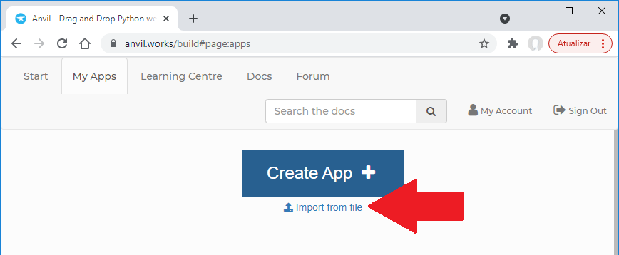

# Manual de Instalação e Configuração

Aqui estão descritos os guias:
- Configuração do Anvil
- Instalação no Google Cloud

# Guia básico de configuração do Anvil

1)	Faça um clone do nosso código fonte [Suggeri.yaml](./site_adm/app/Suggeri.yaml) para a sua conta, clicando no link abaixo:



2)	Você deve habilitar o Anvil Uplink. Na barra lateral esquerda, na tela de edição do código, clique no ícone de engrenagem, vá até Uplink e confirue a opção para conectar como Server Code, como no exemplo abaixo:


 
Esta será a chave que você vai utilizar para criar uma conexão entre o Anvil e toda a estrutura de APIs que criamos no python – e que farão o treinamento e as predições.

3)	Na barra de navegação lateral, clique em “ServerModule1”:


 

4)	No rodapé da janela de código, o Anvil irá lhe mostrar qual o caminho para você testar suas APIs, algo como no exemplo abaixo:


 
 
5)	Se você desejar um caminho mais amigável, é necessário publicar a sua versão da aplicação, onde você poderá criar um endereço único para acessar o site da aplicação. Faça isto, vai facilitar a vida.


# Guia básico de instalação no Google Cloud

1)	Um guia básico e direto pode ser visualizado neste link: https://www.youtube.com/watch?v=5OL7fu2R4M8&list=PLm282P3sC0ge0NNrClpv9i_-BKkKU5zVv&index=1&t=368s

2)	Acessar o site cloud.google.com e criar um cadastro com uma conta do google
* Clicar em “Console”
* Ativar as funções de faturamento (inserir dados de cartão de crédito)
* Abrir o link “Compute Engine” e depois em “Instâncias de VM”
* Abrir “Criar Instância” e escolher as configurações mais adequadas (sugestão é utilizar uma máquina com pelo menos 8GbRAM, uma vez que o treinamento exige uma quantidade razoável de RAM. O ideal seriam 16 GB, mas isso tornaria os custos muito altos, porém a ideia é apenas fazer uma prova de conceito. É interessante que de instalação da VM seja região seja São Paulo. Utilizar o disco  de inicialização padrão, e configurar o firewall para permitir tráfego HTTP e HTTPS. 
* Após a criação da VM, conectar usando o ícone de SSH.
* Pronto, a VM já está funcional, os próximos passos são instalar as nossas APIs.

3)	Configurando a API
* Crie um diretório para a aplicação usando o comando ```	mkdir <nome>```, substituindo <nome> pelo nome que você achar mais interessante.
*	Navegue até o diretório com o comando ```cd <nome>```
*	A tela do SSH possui um ícone no canto superior direito parecido com uma engrenagem. Clique nele e escolha as opções de fazer upload de arquivo, onde devem ser enviados os 3 arquivos de intalação (requiriments.txt, config.py e api_suggeri_cloud.py).
*	Para instalar, execute:
```pip install -r requirements.txt```
*	Após a instalação, vamos instalar o tmux, que é um terminal que irá rodar em background mesmo que você fecha a sua conexão SSH: Execute: ```sudo apt install tmux```
*	A instalação está pronta.

4) Execução via Docker
* Acesse o guia de [instalação via Docker](./servidor_predicao/README.md) para mais detalhes.

# Como configurar a API Python para conectar ao Anvil

Se você for executar a aplicação conectada à sua própria instância do Anvil (o que é uma boa ideia), é necessário configurar o arquivo python config.py para a conexão correta.
Edite este arquivo em um editor de textos puro ou no seu editor python favorito.
No arquivo de configurações, você verá algo como o exemplo abaixo:
 


 
A variável anvil_server_key deve receber a chave única que você criou no item 2 da seção "Guia básico de configuração do Anvil".
As outros duas são os caminhos que o python vai utilizar para informar ao servidor Anvil que o treinamento inicou, e no final, que ele terminou. Você irá substituir nas duas variaváveis a parte "https://suggeri.anvil.app/_/api/" pelo caminho que o Anvil criou pra você, conforme item 4 da seção "Guia básico de configuração do Anvil".


# Executando tudo junto
 
Para finalizar todo o processo e fazer sua cópia do Suggeri funcionar, primeiramente, no site do Anvil, com a sua aplicação aberta, aperte no "Run" para executar:
 
 

 
E na sua instância da VM na GoogleCloud (ou onde você for rodar a API):
*	Abra o tmux:
*	Basta executar o comando ```tmux``` no terminal do linux
*	Execute a nossa aplicação: No terminal do tmux, execute ```python api_suggeri_cloud.py```
*	Pronto! Neste momento, vc irá visualizar que a conexão foi realizada com sucesso ao servidor Anvil.

 Parabéns, a sua cópia do Suggeri está pronta e rodando!