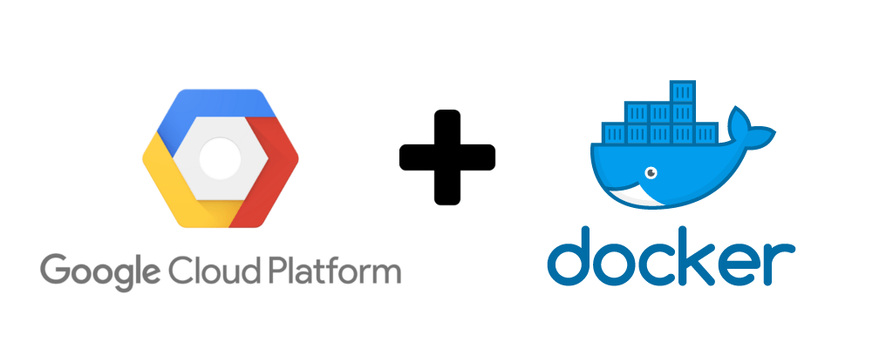

# SERVIDOR DE PREDIÇÃO

Implementação do servidor de treinamento e predição das recomendações.


## Configuração do ambiente

Para executar o projeto é necessário criar um arquivo `.env` com a Key para acesso ao Anvil Works. Utilize o arquivo [env.sample](env.sample) como exemplo:
```bash
ANVIL_UPLINK_KEY=ESCREVA_SUA_KEY_AQUI
```

# Execução do projeto em ambiente docker

Executar o seguinte comando no diretório raiz

```bash
docker-compose up --build -d
```


# Elasticidade usando Docker

O projeto suporta escala horizontal, onde a API pode ser executada em várias instâncias distintas.

O comando para escalar 2 containers python_api é:

```bash
docker-compose up --scale python_api=2
```

Como o seguinte resultado:
```bash
Starting servidor_predicao_python_api_1 ... done
Creating servidor_predicao_python_api_2 ... done
Attaching to servidor_predicao_python_api_1, servidor_predicao_python_api_2
python_api_1  | + python /app/api_suggeri_cloud.py
python_api_2  | + python /app/api_suggeri_cloud.py
```

# Instalação do ambiente

Para instalar os ambientes, utilize o guia [instalacao.md](../instalacao.md).


