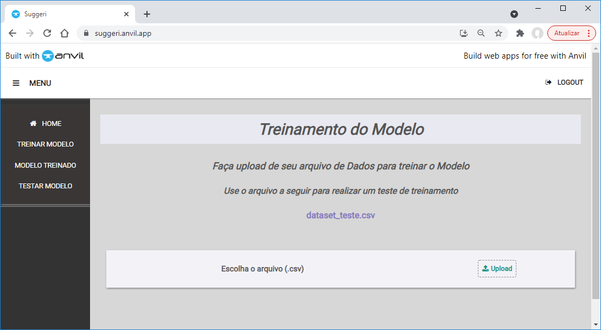

# Site Administrativo

O Site Administrativo é a área restrita dos clientes para enviar os datasets para os treinamentos e testes.

Acessível através do link: [https://suggeri.anvil.app/](https://suggeri.anvil.app/).

## Instalação

O arquivo fonte está disponível no arquivo [Suggeri.yaml](./app/Suggeri.yaml). Para detalhes de como instalar, acesse o [guia de instalação](../instalacao.md).

